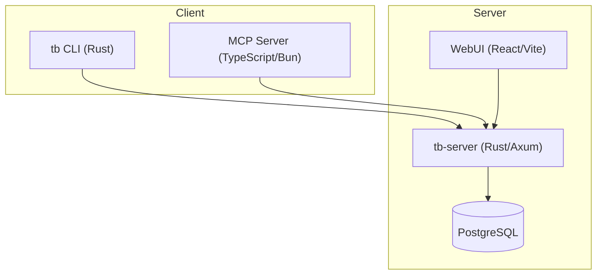
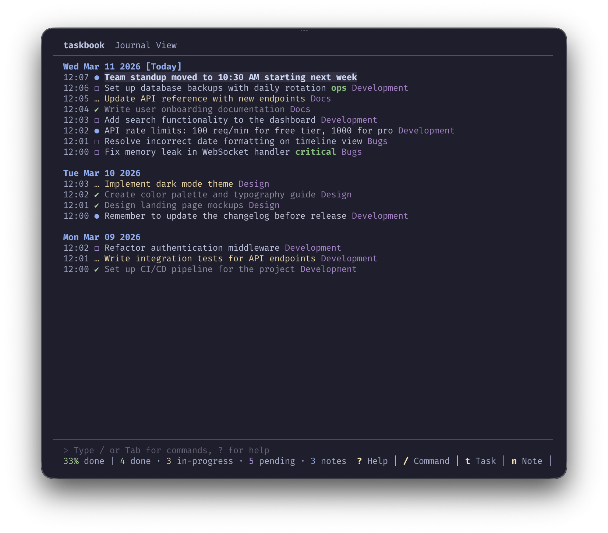
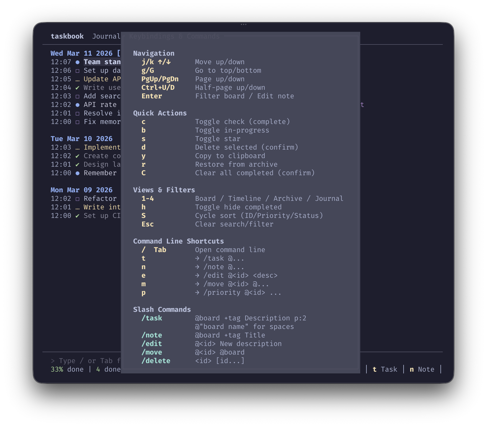

# taskbook

[](https://github.com/tobiashochguertel/taskbook/releases)
[](https://www.npmjs.com/package/@tobiashochguertel/taskbook-mcp-server)
[](LICENSE)

Tasks, boards & notes for the command-line habitat — a Rust rewrite with server sync, OIDC/SSO, WebUI, and AI tool integration.

> **This is a maintained fork** of [taskbook-sh/taskbook](https://github.com/taskbook-sh/taskbook) with significant enhancements including OIDC/SSO authentication, a React WebUI, an MCP server for AI assistants, mobile-responsive design, and more.


## Features

- **TUI Client** — full-featured terminal UI with boards, priorities, timeline, journal, archive
- **Server Sync** — end-to-end encrypted (AES-256-GCM) sync across devices
- **OIDC/SSO** — single sign-on via Authelia, Keycloak, or any OpenID Connect provider
- **Web UI** — responsive React SPA with mobile support, dark/light themes
- **MCP Server** — 15 tools for AI assistants (GitHub Copilot, Claude, VS Code, Cursor)
- **Catppuccin Themes** — macchiato, mocha, frappé, latte + high-contrast + custom RGB
- **OpenAPI** — auto-generated API docs at `/swagger-ui`

<details>
<summary><b>🏗️ Architecture</b></summary>



| Component | Language | Description |
|-----------|----------|-------------|
| [taskbook-client](crates/taskbook-client) | Rust | TUI CLI client (`tb`) |
| [taskbook-server](crates/taskbook-server) | Rust | REST API server (`tb-server`) |
| [taskbook-common](crates/taskbook-common) | Rust | Shared types and encryption |
| [taskbook-webui](packages/taskbook-webui) | TypeScript | React web interface |
| [taskbook-mcp-server](packages/taskbook-mcp-server) | TypeScript | MCP protocol server |

</details>

## Installation

### Binary Downloads

Download the latest binary for your platform from [GitHub Releases](https://github.com/tobiashochguertel/taskbook/releases):

| Platform | Architecture | Binary |
|----------|-------------|--------|
| Linux | x86_64 | `tb-linux-amd64` |
| Linux | aarch64 | `tb-linux-arm64` |
| macOS | x86_64 | `tb-darwin-amd64` |
| macOS | aarch64 | `tb-darwin-arm64` |

```bash
curl -L https://github.com/tobiashochguertel/taskbook/releases/latest/download/tb-linux-amd64 -o tb
chmod +x tb && sudo mv tb /usr/local/bin/
```

### Cargo

```bash
cargo install --git https://github.com/tobiashochguertel/taskbook --bin tb
```

### Docker

```bash
docker compose up -d server postgres
```

See [docker-compose.yml](docker-compose.yml) for the full service definition (server, postgres, client, mcp-server, webui).

<details>
<summary><b>Nix Flake</b></summary>

```nix
{
  inputs.taskbook.url = "github:tobiashochguertel/taskbook";

  # Add to your packages
  environment.systemPackages = [ inputs.taskbook.packages.${system}.default ];
}
```

Or run directly:

```bash
nix run github:tobiashochguertel/taskbook
```

</details>

## Screenshots

<details>
<summary><b>📸 View Screenshots</b></summary>

### Board View

Organize tasks and notes into boards with priority levels and progress tracking.


### Timeline View

View all items chronologically, grouped by date.


### Journal View

A detailed journal of all activity with timestamps.



### Commands

Access commands directly from the TUI with `/` or Tab.


### Help

Full keyboard shortcut reference available with `?`.



### Archive View

Browse and restore deleted items.


</details>

## Usage

```bash
tb                          # Display board view (TUI)
tb --task "Description"     # Create task
tb --task @board "Desc"     # Create task in specific board
tb --task "Desc" p:2        # Create with priority (1=normal, 2=medium, 3=high)
tb --note "Description"     # Create note
tb --note                   # Create note in external editor
tb --edit-note @<id>        # Edit note in external editor
tb --check <id> [id...]     # Toggle task complete
tb --begin <id> [id...]     # Toggle task in-progress
tb --star <id> [id...]      # Toggle starred
tb --delete <id> [id...]    # Delete to archive
tb --restore <id> [id...]   # Restore from archive
tb --edit @<id> "New desc"  # Edit description
tb --move @<id> board       # Move to board
tb --priority @<id> <1-3>   # Set priority
tb --find <term>            # Search items
tb --list <attributes>      # Filter (pending, done, task, note, starred)
tb --timeline               # Chronological view
tb --archive                # View archived items
tb --clear                  # Delete all completed tasks
tb --copy <id> [id...]      # Copy descriptions to clipboard
```

## Server Sync

Sync tasks across devices with end-to-end encrypted server storage:

```bash
tb --register               # Create account (interactive)
tb --migrate                # Upload existing local data to server
tb --login                  # Login on another device
tb --status                 # Check sync status
tb --logout                 # Return to local-only mode
```

All data is encrypted client-side with **AES-256-GCM** before being sent to the server. Your encryption key is generated locally during registration and never leaves your device.

### OIDC/SSO Login

The server supports single sign-on via any OpenID Connect provider (Authelia, Keycloak, etc.):

```bash
# Browser-based login (opens default browser)
tb --login-sso

# Headless/SSH login (displays URL to open manually)
tb --login-sso-manual
```

Set `TB_OIDC_ISSUER` on the server to enable. See [Server Setup](docs/03-server/01-server-setup.md).

## MCP Server

The [MCP server](packages/taskbook-mcp-server) exposes 15 taskbook operations as tools for AI assistants via the [Model Context Protocol](https://modelcontextprotocol.io).

```bash
# Install globally
bun add -g @tobiashochguertel/taskbook-mcp-server

# Run with stdio transport (default for editor integrations)
taskbook-mcp

# Run with HTTP transport (for remote/Docker deployments)
TB_MCP_TRANSPORT=http TB_MCP_PORT=3100 taskbook-mcp
```

See the [MCP server README](packages/taskbook-mcp-server/README.md) for AI tool configuration guides ([Copilot CLI](docs/ai-agent-tools/copilot-cli.md), [VS Code](docs/ai-agent-tools/vscode.md), [Claude](docs/ai-agent-tools/claude.md), [Cursor](docs/ai-agent-tools/cursor.md), [OpenCode](docs/ai-agent-tools/opencode.md)).

## Configuration

Configuration is stored in `~/.taskbook.json`:

```json
{
  "taskbookDirectory": "~",
  "displayCompleteTasks": true,
  "displayProgressOverview": true,
  "theme": "catppuccin-macchiato",
  "sync": {
    "enabled": false,
    "serverUrl": "https://your-taskbook-server.example.com"
  }
}
```

### Themes

Available preset themes: `default`, `catppuccin-macchiato`, `catppuccin-mocha`, `catppuccin-frappe`, `catppuccin-latte`, `high-contrast`

Or define custom RGB colors — see [Configuration docs](docs/02-usage/02-configuration.md).

## Documentation

| Guide | Description |
|-------|-------------|
| [Installation](docs/01-getting-started/01-installation.md) | Binary, Cargo, Docker, Nix |
| [Quick Start](docs/01-getting-started/02-quick-start.md) | First steps with taskbook |
| [CLI Reference](docs/02-usage/01-cli-reference.md) | All commands and options |
| [Configuration](docs/02-usage/02-configuration.md) | Themes, sync, display settings |
| [Server Setup](docs/03-server/01-server-setup.md) | Deploy tb-server + PostgreSQL |
| [Sync & Encryption](docs/03-server/02-sync-encryption.md) | E2E encryption details |
| [MCP Server](packages/taskbook-mcp-server/README.md) | AI tool integration |
| [WebUI](packages/taskbook-webui/README.md) | React web interface |

## Data Compatibility

This implementation uses the same data format and directory (`~/.taskbook/`) as the original Node.js version, allowing seamless migration.

## Fork Enhancements

This fork adds the following features over the [upstream](https://github.com/taskbook-sh/taskbook):

- **OIDC/SSO Authentication** — browser-based and headless SSO login via OpenID Connect
- **React WebUI** — full-featured web interface with mobile-responsive design
- **MCP Server** — Model Context Protocol integration for AI assistants (15 tools)
- **OpenAPI/Swagger** — auto-generated API documentation at `/swagger-ui`
- **Mobile Support** — touch-optimized WebUI with bottom sheets, FAB, tab navigation
- **Encryption Key Management** — server-side key storage for OIDC users
- **Connection Status** — real-time SSE-based connection monitoring in WebUI and CLI
- **Profile Management** — edit username/display name from WebUI settings
- **Docker Compose Profiles** — `default`, `full`, `mcp`, `authelia` configurations
- **Container Image Publishing** — multi-arch images on GitHub Container Registry
- **NPM Package** — `@tobiashochguertel/taskbook-mcp-server` published on npmjs.com
- **Enhanced CI/CD** — CodeQL, release automation, npm publishing with OIDC provenance

## License

MIT — see [LICENSE](LICENSE)

## Credits

- **Fork maintained by** [Tobias Hochgürtel](https://github.com/tobiashochguertel) — OIDC/SSO, WebUI, MCP server, mobile support, and more
- **Original Rust port by** [Alexander Davidsen](https://github.com/taskbook-sh/taskbook) — CLI, server, encryption, sync
- **Original Node.js project by** [Klaus Sinani](https://github.com/klaussinani/taskbook) — concept and design
