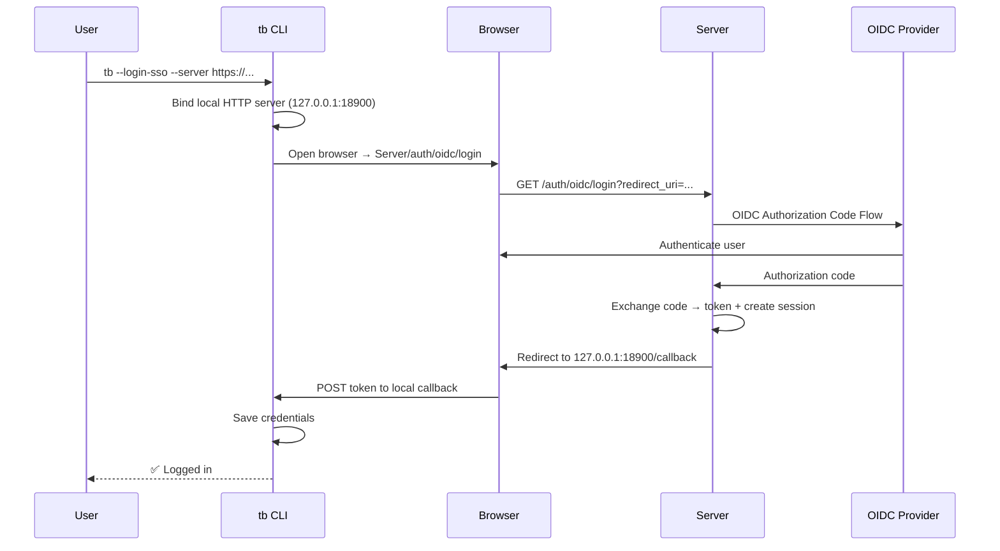
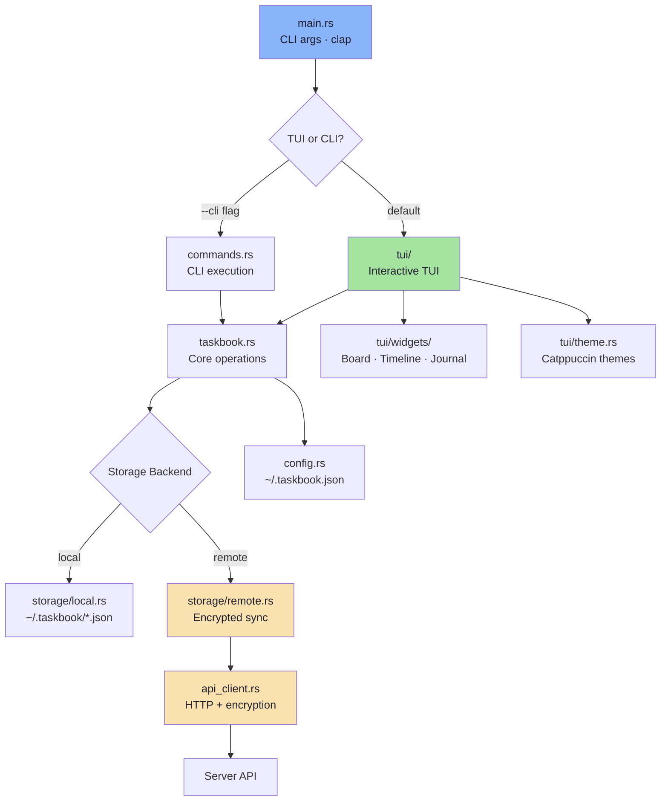

# ✅ taskbook-client (`tb`)

A fast, TUI-based command-line client for managing tasks and notes directly from your terminal. Supports board/timeline/archive views, Catppuccin themes, server sync with end-to-end encryption, and OIDC single sign-on.

## 📑 Table of Contents

- [Features](#-features)
- [Installation](#-installation)
- [Quick Start](#-quick-start)
- [CLI Reference](#-cli-reference)
- [Input Syntax](#-input-syntax)
- [Configuration](#-configuration)
- [Server Sync](#-server-sync)
- [Architecture](#-architecture)

## ✨ Features

| Category         | Details                                                                             |
| ---------------- | ----------------------------------------------------------------------------------- |
| 📋 **Views**     | Board view, timeline view, archive view, journal view                               |
| 🎨 **Themes**    | Catppuccin (Macchiato, Mocha, Frappé, Latte), high-contrast, custom RGB             |
| ✏️ **Items**     | Tasks (with completion, progress, priority 1-3) and Notes (with optional rich body) |
| 🔍 **Search**    | Find items by keyword, filter by attributes/tags                                    |
| 📎 **Clipboard** | Copy item descriptions to system clipboard                                          |
| 🏷 **Tags**      | Tag items with `+tag` syntax, filter by tag                                         |
| 🔄 **Sync**      | Server sync with AES-256-GCM end-to-end encryption                                  |
| 🔑 **Auth**      | Username/password, OIDC SSO (browser + headless), direct token                      |
| 📝 **Editor**    | External editor integration (`$EDITOR`/`$VISUAL`/vi) for note bodies                |

## 📥 Installation

### Binary Download

Download the latest release for your platform from [GitHub Releases](https://github.com/tobiashochguertel/taskbook/releases):

```bash
# Linux (x86_64)
curl -L https://github.com/tobiashochguertel/taskbook/releases/latest/download/tb-linux-amd64 -o tb
chmod +x tb && mv tb ~/.local/bin/
```

### Cargo Install

```bash
cargo install --git https://github.com/tobiashochguertel/taskbook
```

Requires Rust 1.75+.

### Nix Flake

```bash
nix run github:tobiashochguertel/taskbook
```

### Build from Source

```bash
git clone https://github.com/tobiashochguertel/taskbook.git
cd taskbook
cargo build --release
cp target/release/tb ~/.local/bin/
```

## 🚀 Quick Start

```bash
# Create a task on the default board
tb -t Fix login bug p:2

# Create a task on a specific board with tags
tb -t @backend Refactor auth module p:3 +urgent

# Create a note
tb -n @meetings Sprint planning notes

# Check/complete a task
tb -c 1

# View boards (default)
tb

# View timeline
tb -i

# View archive
tb -a

# Search items
tb -f deploy

# Star an item
tb -s 1 3
```

## 📖 CLI Reference

### Display Commands

| Flag         | Short | Description            |
| ------------ | ----- | ---------------------- |
| _(default)_  |       | Display board view     |
| `--timeline` | `-i`  | Display timeline view  |
| `--archive`  | `-a`  | Display archived items |

### Creation Commands

| Flag     | Short | Description       |
| -------- | ----- | ----------------- |
| `--task` | `-t`  | Create a new task |
| `--note` | `-n`  | Create a new note |

### Modification Commands

| Flag          | Short | Description                       |
| ------------- | ----- | --------------------------------- |
| `--check`     | `-c`  | Check/uncheck task(s)             |
| `--begin`     | `-b`  | Start/pause task(s)               |
| `--star`      | `-s`  | Star/unstar item(s)               |
| `--priority`  | `-p`  | Update task priority              |
| `--edit`      | `-e`  | Edit item description             |
| `--edit-note` |       | Edit note body in external editor |
| `--move`      | `-m`  | Move item to another board        |
| `--tag`       |       | Add/remove tags on item           |
| `--copy`      | `-y`  | Copy description to clipboard     |

### Search & Filter Commands

| Flag     | Short | Description              |
| -------- | ----- | ------------------------ |
| `--find` | `-f`  | Search items by keyword  |
| `--list` | `-l`  | List items by attributes |

### Deletion Commands

| Flag        | Short | Description                  |
| ----------- | ----- | ---------------------------- |
| `--delete`  | `-d`  | Delete item(s)               |
| `--restore` | `-r`  | Restore item(s) from archive |
| `--clear`   |       | Delete all checked items     |

### Server & Auth Commands

| Flag                     | Description                             |
| ------------------------ | --------------------------------------- |
| `--register`             | Register a new server account           |
| `--login`                | Log in with username/password           |
| `--login-sso`            | Log in via browser-based OIDC           |
| `--login-sso-manual`     | SSO for headless/SSH hosts (prints URL) |
| `--set-token`            | Save session token directly             |
| `--logout`               | Log out and delete credentials          |
| `--status`               | Show sync status                        |
| `--migrate`              | Push local data to server               |
| `--reset-encryption-key` | Reset key (⚠️ deletes all server data)  |

### Server Auth Options

| Option              | Description             |
| ------------------- | ----------------------- |
| `--server <URL>`    | Server URL              |
| `--username <NAME>` | Username                |
| `--email <EMAIL>`   | Email (register only)   |
| `--password <PASS>` | Password                |
| `--key <BASE64>`    | Encryption key (base64) |
| `--token <TOKEN>`   | Session token           |

### Global Options

| Option                  | Description              |
| ----------------------- | ------------------------ |
| `--taskbook-dir <PATH>` | Custom data directory    |
| `--cli`                 | Non-interactive CLI mode |
| `--help` / `-h`         | Show help                |
| `--version` / `-v`      | Show version             |

## 🏷 Input Syntax

When creating or modifying items, use inline modifiers:

| Prefix | Meaning        | Example                                      |
| ------ | -------------- | -------------------------------------------- |
| `@`    | Board name     | `@backend`, `@"My Board"`                    |
| `p:`   | Priority (1–3) | `p:1` (normal), `p:2` (medium), `p:3` (high) |
| `+`    | Tag            | `+urgent`, `+frontend`                       |

Tokens not matching any prefix become the item description.

```bash
# Full example
tb --task @backend @devops Deploy new API p:3 +urgent +release
#          ^^^^^^^^ ^^^^^^ ^^^^^^^^^^^^^^ ^^^  ^^^^^^^ ^^^^^^^^
#          board1   board2  description   pri  tag1    tag2
```

### Tag Operations

```bash
tb --tag @3 +urgent            # Add +urgent tag to item 3
tb --tag @3 -urgent            # Remove urgent tag from item 3
tb --list +urgent              # List all items tagged +urgent
```

## ⚙️ Configuration

### Config File: `~/.taskbook.json`

Auto-created on first run with defaults:

```json
{
  "taskbookDirectory": "~",
  "displayCompleteTasks": true,
  "displayProgressOverview": true,
  "theme": "default",
  "sortMethod": "id",
  "defaultView": "board",
  "sync": {
    "enabled": false,
    "serverUrl": "http://localhost:8080"
  }
}
```

### Theme Options

| Theme                  | Description                     |
| ---------------------- | ------------------------------- |
| `default`              | Neutral system-friendly colors  |
| `catppuccin-macchiato` | Catppuccin Macchiato (dark)     |
| `catppuccin-mocha`     | Catppuccin Mocha (darkest)      |
| `catppuccin-frappe`    | Catppuccin Frappé (medium dark) |
| `catppuccin-latte`     | Catppuccin Latte (light)        |
| `high-contrast`        | High contrast for accessibility |

Custom themes use inline RGB objects:

```json
{
  "theme": {
    "muted": { "r": 140, "g": 140, "b": 140 },
    "success": { "r": 134, "g": 239, "b": 172 },
    "warning": { "r": 253, "g": 224, "b": 71 },
    "error": { "r": 252, "g": 129, "b": 129 },
    "info": { "r": 147, "g": 197, "b": 253 },
    "pending": { "r": 216, "g": 180, "b": 254 },
    "starred": { "r": 253, "g": 224, "b": 71 }
  }
}
```

### Data Directory

| Path                               | Contents                         |
| ---------------------------------- | -------------------------------- |
| `~/.taskbook/storage/storage.json` | Active items                     |
| `~/.taskbook/archive/archive.json` | Archived items                   |
| `~/.taskbook/credentials.json`     | Server credentials (mode `0600`) |

Override with `--taskbook-dir <PATH>` or `TASKBOOK_DIR` env var.

### Environment Variables

| Variable            | Description                                        |
| ------------------- | -------------------------------------------------- |
| `TASKBOOK_DIR`      | Override data directory                            |
| `EDITOR` / `VISUAL` | External editor for `--edit-note` (fallback: `vi`) |

## 🔄 Server Sync

### Setup

```bash
# Register a new account
tb --register --server https://taskbook.example.com

# Or login to existing account
tb --login --server https://taskbook.example.com

# Or use OIDC single sign-on
tb --login-sso --server https://taskbook.example.com

# For headless/SSH hosts
tb --login-sso-manual --server https://taskbook.example.com
```

### Encryption

All items are encrypted **client-side** with AES-256-GCM before upload. The server stores only opaque ciphertext — it never sees your data.

- A 256-bit encryption key is generated at registration
- The key is stored locally in `~/.taskbook/credentials.json`
- A SHA-256 hash of the key is stored server-side for cross-device verification
- Use `--key <BASE64>` during login to supply an existing key on a new device

### Sync Status

```bash
tb --status       # Show server URL, sync status, account info
tb --migrate      # Push local-only items to server
tb --logout       # Disconnect from server
```

### SSO Flow



## 🏗 Architecture



### Key Modules

| Module               | Purpose                                            |
| -------------------- | -------------------------------------------------- |
| `main.rs`            | CLI arg parsing (clap), routing to TUI or CLI mode |
| `commands.rs`        | CLI command execution                              |
| `taskbook.rs`        | Core task/note CRUD, storage abstraction, stats    |
| `storage/local.rs`   | JSON file–based local storage                      |
| `storage/remote.rs`  | Server-backed storage with E2E encryption          |
| `api_client.rs`      | HTTP client (reqwest) for server communication     |
| `auth.rs` / `sso.rs` | Registration, login, OIDC browser flow             |
| `config.rs`          | Config parsing, theme definitions                  |
| `credentials.rs`     | Secure credential storage (`0600` permissions)     |
| `tui/`               | Interactive terminal UI (ratatui + crossterm)      |
| `render.rs`          | Colored console output for CLI mode                |
| `editor.rs`          | External editor integration                        |

---

> **Audience:** End-users wanting a fast task manager, and developers extending the client.
