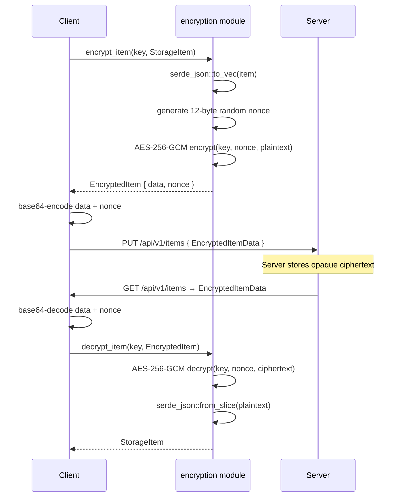

# 📦 taskbook-common

Shared library crate providing types, encryption primitives, and API models used by both the **taskbook-client** (`tb`) and **taskbook-server** (`tb-server`). This crate is the single source of truth for data structures that cross the client–server boundary.

## 📑 Table of Contents

- [Module Overview](#-module-overview)
- [Models](#-models)
- [API Types](#-api-types)
- [Encryption](#-encryption)
- [Error Handling](#-error-handling)
- [Board Utilities](#-board-utilities)
- [Usage Examples](#-usage-examples)

## 🗂 Module Overview

| Module       | Purpose                            | Key Exports                                                         |
| ------------ | ---------------------------------- | ------------------------------------------------------------------- |
| `models`     | Core domain types                  | `StorageItem`, `Task`, `Note`, `Item` trait                         |
| `api`        | REST request/response DTOs         | `EncryptedItemData`, `ItemsResponse`, `PutItemsRequest`, auth types |
| `encryption` | AES-256-GCM encrypt/decrypt        | `encrypt_item()`, `decrypt_item()`, `generate_key()`                |
| `error`      | Shared error types                 | `CommonError`, `CommonResult<T>`                                    |
| `board`      | Board name parsing & normalization | `parse_cli_input()`, `normalize_board_name()`                       |

## 🏗 Models

### StorageItem Enum

The primary data container — every persisted item is either a **Task** or a **Note**:

```rust
pub enum StorageItem {
    Task(Task),
    Note(Note),
}
```

Discrimination uses the `_isTask` JSON field for backward-compatible serde:

```json
{ "_isTask": true, "_id": 1, "description": "Ship v2", "isComplete": false, "priority": 2 }
{ "_isTask": false, "_id": 2, "description": "Meeting notes", "body": "Discussed roadmap..." }
```

### Item Trait

Shared interface implemented by `Task`, `Note`, and `StorageItem`:

```rust
pub trait Item {
    fn id(&self) -> u64;
    fn date(&self) -> &str;
    fn timestamp(&self) -> i64;
    fn description(&self) -> &str;
    fn is_starred(&self) -> bool;
    fn boards(&self) -> &[String];
    fn tags(&self) -> &[String];
    fn is_task(&self) -> bool;
}
```

### Task

| Field          | Type          | JSON Key      | Description                                |
| -------------- | ------------- | ------------- | ------------------------------------------ |
| `id`           | `u64`         | `_id`         | Unique identifier                          |
| `date`         | `String`      | `_date`       | Creation date                              |
| `timestamp`    | `i64`         | `_timestamp`  | Unix timestamp                             |
| `is_task_flag` | `bool`        | `_isTask`     | Always `true`                              |
| `description`  | `String`      | `description` | Task text                                  |
| `is_starred`   | `bool`        | `isStarred`   | Starred flag                               |
| `is_complete`  | `bool`        | `isComplete`  | Completion status                          |
| `in_progress`  | `bool`        | `inProgress`  | In-progress status                         |
| `priority`     | `u8`          | `priority`    | 1 (normal), 2 (medium), 3 (high) — clamped |
| `boards`       | `Vec<String>` | `boards`      | Board memberships                          |
| `tags`         | `Vec<String>` | `tags`        | Tags (optional)                            |

### Note

| Field          | Type             | JSON Key      | Description               |
| -------------- | ---------------- | ------------- | ------------------------- |
| `id`           | `u64`            | `_id`         | Unique identifier         |
| `date`         | `String`         | `_date`       | Creation date             |
| `timestamp`    | `i64`            | `_timestamp`  | Unix timestamp            |
| `is_task_flag` | `bool`           | `_isTask`     | Always `false`            |
| `description`  | `String`         | `description` | Note title                |
| `body`         | `Option<String>` | `body`        | Rich note body (optional) |
| `is_starred`   | `bool`           | `isStarred`   | Starred flag              |
| `boards`       | `Vec<String>`    | `boards`      | Board memberships         |
| `tags`         | `Vec<String>`    | `tags`        | Tags (optional)           |

## 🌐 API Types

Request and response DTOs for client–server communication:

| Type                | Direction | Endpoint                | Fields                                       |
| ------------------- | --------- | ----------------------- | -------------------------------------------- |
| `RegisterRequest`   | → Server  | `POST /api/v1/register` | `username`, `email`, `password`              |
| `RegisterResponse`  | ← Server  |                         | `token`                                      |
| `LoginRequest`      | → Server  | `POST /api/v1/login`    | `username`, `password`                       |
| `LoginResponse`     | ← Server  |                         | `token`                                      |
| `MeResponse`        | ← Server  | `GET /api/v1/me`        | `username`, `email`                          |
| `HealthResponse`    | ← Server  | `GET /api/v1/health`    | `status`                                     |
| `EncryptedItemData` | ↔         | Items sync              | `data` (base64 ciphertext), `nonce` (base64) |
| `ItemsResponse`     | ← Server  | `GET /api/v1/items`     | `items: HashMap<String, EncryptedItemData>`  |
| `PutItemsRequest`   | → Server  | `PUT /api/v1/items`     | `items: HashMap<String, EncryptedItemData>`  |

## 🔐 Encryption

End-to-end encryption ensures the server **never** sees plaintext item data.

### Algorithm Details

| Parameter  | Value                           |
| ---------- | ------------------------------- |
| Algorithm  | AES-256-GCM (AEAD)              |
| Key size   | 256-bit (32 bytes)              |
| Nonce size | 12 bytes (random per operation) |
| Key format | Hex or Base64 encoded           |
| Auth tag   | Built-in GCM authentication     |
| Library    | `aes-gcm` v0.10                 |
| RNG        | `OsRng` (OS-level CSPRNG)       |

### Encryption Flow



### Key Functions

```rust
/// Generate a new random 256-bit encryption key
pub fn generate_key() -> [u8; 32]

/// Encrypt a StorageItem with AES-256-GCM
pub fn encrypt_item(key: &[u8; 32], item: &StorageItem) -> Result<EncryptedItem, CommonError>

/// Decrypt an EncryptedItem back to StorageItem
pub fn decrypt_item(key: &[u8; 32], encrypted: &EncryptedItem) -> Result<StorageItem, CommonError>
```

## ⚠️ Error Handling

```rust
pub enum CommonError {
    /// JSON serialization/deserialization failure
    Json(serde_json::Error),
    /// Nonce length mismatch (expected 12 bytes)
    InvalidNonce { expected: usize, got: usize },
    /// AES-GCM authentication failed (wrong key or tampered data)
    DecryptionFailed,
}

pub type CommonResult<T> = Result<T, CommonError>;
```

## 🏷 Board Utilities

The `board` module handles CLI input parsing and board name normalization:

```rust
// Parse CLI input tokens into structured data
let (boards, description, priority, tags) = parse_cli_input(&tokens);
// e.g. ["@coding", "Fix", "bug", "p:3", "+urgent"]
//   → boards: ["coding"], desc: "Fix bug", priority: 3, tags: ["urgent"]

// Normalize board names (strip @, handle aliases)
normalize_board_name("@coding")  // → "coding"
normalize_board_name("myboard")  // → "My Board"

// Display formatting
display_name("coding")    // → "@coding"
display_name("My Board")  // → "My Board"
```

## 💡 Usage Examples

### Encrypting and Decrypting Items

```rust
use taskbook_common::encryption::{generate_key, encrypt_item, decrypt_item};
use taskbook_common::models::Task;
use taskbook_common::StorageItem;

// Generate a new encryption key
let key = generate_key();

// Create a task
let task = Task::new(1, "Ship feature".into(), vec!["My Board".into()], 2);
let item = StorageItem::Task(task);

// Encrypt
let encrypted = encrypt_item(&key, &item).expect("encryption failed");

// Decrypt
let decrypted = decrypt_item(&key, &encrypted).expect("decryption failed");
assert_eq!(decrypted.description(), "Ship feature");
```

### Working with API Types

```rust
use taskbook_common::api::{EncryptedItemData, PutItemsRequest};
use std::collections::HashMap;
use base64::Engine;
use base64::engine::general_purpose::STANDARD;

let encrypted = encrypt_item(&key, &item).unwrap();

let api_item = EncryptedItemData {
    data: STANDARD.encode(&encrypted.data),
    nonce: STANDARD.encode(&encrypted.nonce),
};

let request = PutItemsRequest {
    items: HashMap::from([("1".to_string(), api_item)]),
};

let json = serde_json::to_string(&request).unwrap();
```

---

> **Audience:** Developers & Architects building on or integrating with the Taskbook ecosystem.
