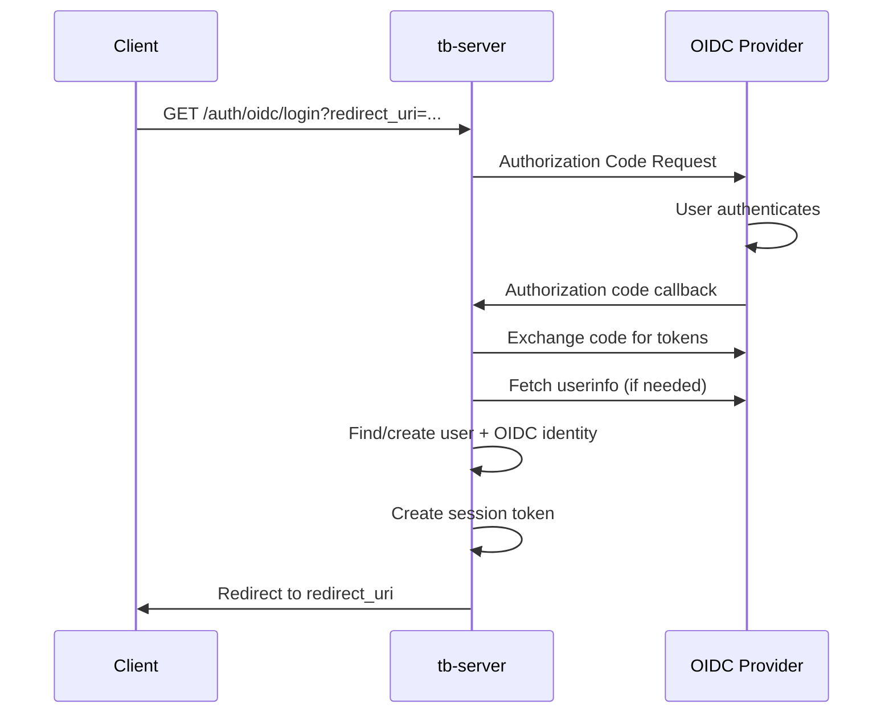
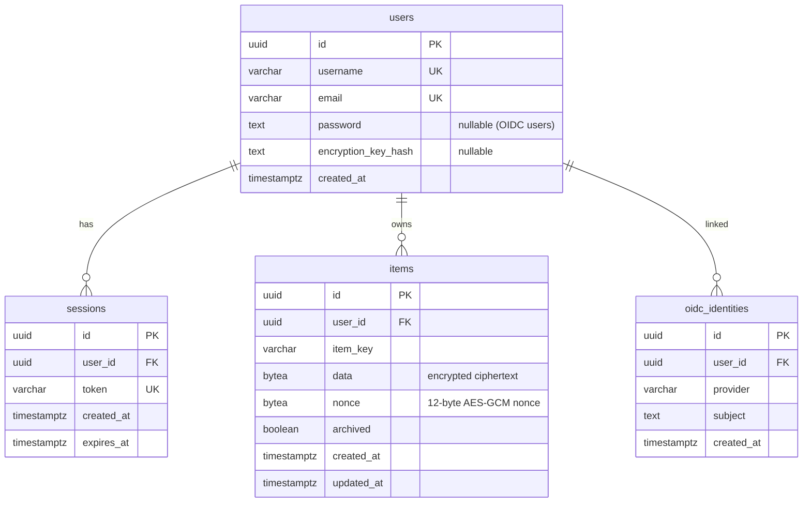
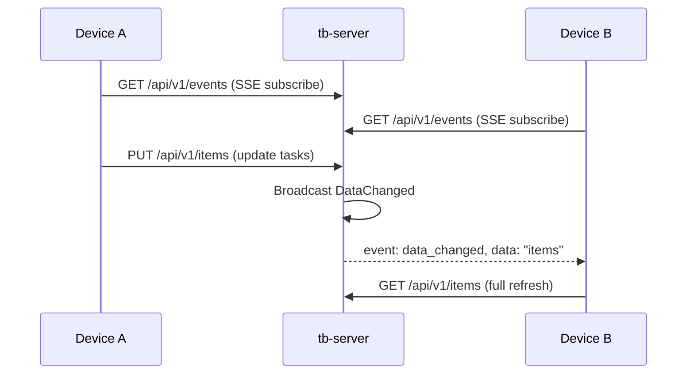

# 🖥 taskbook-server (`tb-server`)

A production-ready REST API server enabling multi-device sync for Taskbook. Built with Axum, PostgreSQL, and end-to-end encryption — the server **never** sees plaintext item data. Ships with OIDC/SSO support, Prometheus metrics, rate limiting, embedded WebUI, and OpenAPI/Swagger documentation.

## 📑 Table of Contents

- [Features](#-features)
- [Quick Start](#-quick-start)
- [Environment Variables](#-environment-variables)
- [API Routes](#-api-routes)
- [Authentication](#-authentication)
- [Database](#-database)
- [Real-time Sync](#-real-time-sync)
- [Monitoring](#-monitoring)
- [Architecture](#-architecture)

## ✨ Features

| Category                 | Details                                                              |
| ------------------------ | -------------------------------------------------------------------- |
| 🗄 **Database**          | PostgreSQL with sqlx async toolkit and auto-migrations               |
| 🔑 **Auth**              | Argon2id password hashing, session tokens, OIDC/SSO                  |
| 🔐 **Encryption**        | Client-side AES-256-GCM; server stores only ciphertext               |
| 📡 **Real-time**         | Server-Sent Events (SSE) for cross-device sync                       |
| 📊 **Metrics**           | Prometheus endpoint (`/metrics`) with HTTP, DB pool, and SSE metrics |
| 🚦 **Rate Limiting**     | Per-IP sliding window on auth endpoints                              |
| 🌐 **WebUI**             | Embedded SPA with compile-time asset bundling                        |
| 📄 **Docs**              | OpenAPI 3.0 spec + Swagger UI at `/api/docs`                         |
| 🛡 **CORS**              | Configurable allowed origins                                         |
| 🔄 **Graceful Shutdown** | Handles SIGINT + SIGTERM for clean container stops                   |

## 🚀 Quick Start

### Docker Compose

```yaml
version: "3.8"
services:
  db:
    image: postgres:16
    environment:
      POSTGRES_DB: taskbook
      POSTGRES_USER: taskbook
      POSTGRES_PASSWORD: secret
    volumes:
      - pgdata:/var/lib/postgresql/data

  server:
    image: ghcr.io/taskbook-sh/taskbook-server:latest
    depends_on: [db]
    ports:
      - "8080:8080"
    environment:
      TB_DB_HOST: db
      TB_DB_PORT: "5432"
      TB_DB_NAME: taskbook
      TB_DB_USER: taskbook
      TB_DB_PASSWORD: secret
      TB_PORT: "8080"

volumes:
  pgdata:
```

```bash
docker compose up -d
# Server is ready at http://localhost:8080
# Swagger UI at http://localhost:8080/api/docs
```

### Manual Setup

```bash
# 1. Start PostgreSQL
# 2. Set environment variables (see table below)
export TB_DB_HOST=localhost TB_DB_NAME=taskbook TB_DB_USER=taskbook TB_DB_PASSWORD=secret

# 3. Run the server (migrations run automatically)
cargo run --release -p taskbook-server
```

## 🔧 Environment Variables

### Required (Database)

| Variable         | Type   | Description              |
| ---------------- | ------ | ------------------------ |
| `TB_DB_HOST`     | String | PostgreSQL hostname      |
| `TB_DB_NAME`     | String | PostgreSQL database name |
| `TB_DB_USER`     | String | PostgreSQL username      |
| `TB_DB_PASSWORD` | String | PostgreSQL password      |

### Optional (Server)

| Variable                 | Type   | Default   | Description                  |
| ------------------------ | ------ | --------- | ---------------------------- |
| `TB_DB_PORT`             | u16    | `5432`    | PostgreSQL port              |
| `TB_HOST`                | IpAddr | `0.0.0.0` | Server bind address          |
| `TB_PORT`                | u16    | `8080`    | Server bind port             |
| `TB_SESSION_EXPIRY_DAYS` | i64    | `30`      | Session token expiry in days |
| `TB_CORS_ORIGINS`        | String | _(empty)_ | Comma-separated CORS origins |

### Optional (OIDC/SSO)

OIDC is enabled only when **all three** of issuer, client ID, and client secret are set:

| Variable                    | Type   | Description                                                              |
| --------------------------- | ------ | ------------------------------------------------------------------------ |
| `TB_OIDC_ISSUER`            | String | OIDC provider issuer URL                                                 |
| `TB_OIDC_CLIENT_ID`         | String | OIDC client ID                                                           |
| `TB_OIDC_CLIENT_SECRET`     | String | OIDC client secret                                                       |
| `TB_OIDC_BASE_URL`          | String | Public base URL for redirect URI (default: `http://{TB_HOST}:{TB_PORT}`) |
| `TB_OIDC_ALLOWED_REDIRECTS` | String | Comma-separated allowed post-login redirect URI prefixes                 |

## 🛣 API Routes

### Public Endpoints

| Method | Path                     | Description                                    |
| ------ | ------------------------ | ---------------------------------------------- |
| `GET`  | `/api/v1/info`           | Service information and endpoint references    |
| `GET`  | `/api/v1/health`         | Health check (tests DB connectivity)           |
| `POST` | `/api/v1/register`       | Register new user (🚦 rate limited)            |
| `POST` | `/api/v1/login`          | Login with username/password (🚦 rate limited) |
| `GET`  | `/metrics`               | Prometheus metrics                             |
| `GET`  | `/api/docs`              | Swagger UI                                     |
| `GET`  | `/api/docs/openapi.json` | OpenAPI 3.0 spec                               |

### Authenticated Endpoints

All require `Authorization: Bearer <token>` header.

| Method   | Path                        | Description                                   |
| -------- | --------------------------- | --------------------------------------------- |
| `DELETE` | `/api/v1/logout`            | Logout (delete all sessions)                  |
| `GET`    | `/api/v1/me`                | Get current user profile                      |
| `PATCH`  | `/api/v1/me`                | Update profile (username)                     |
| `GET`    | `/api/v1/me/encryption-key` | Check encryption key status                   |
| `POST`   | `/api/v1/me/encryption-key` | Store encryption key hash                     |
| `DELETE` | `/api/v1/me/encryption-key` | Reset key + delete all items ⚠️               |
| `GET`    | `/api/v1/items`             | Get encrypted active items                    |
| `PUT`    | `/api/v1/items`             | Replace encrypted active items (max 10,000)   |
| `GET`    | `/api/v1/items/archive`     | Get encrypted archived items                  |
| `PUT`    | `/api/v1/items/archive`     | Replace encrypted archived items (max 10,000) |
| `GET`    | `/api/v1/events`            | SSE stream for real-time sync notifications   |

### OIDC Endpoints (when enabled)

| Method | Path               | Description                        |
| ------ | ------------------ | ---------------------------------- |
| `GET`  | `/auth/oidc/login` | OIDC login (redirects to provider) |

### WebUI

| Path            | Description                                                     |
| --------------- | --------------------------------------------------------------- |
| `/*` (fallback) | Embedded SPA with `index.html` fallback for client-side routing |

## 🔑 Authentication

### Methods

| Method       | Use Case                                                               |
| ------------ | ---------------------------------------------------------------------- |
| **Password** | Register with `POST /register`, login with `POST /login`               |
| **OIDC/SSO** | Browser-based login via configured identity provider                   |
| **Token**    | `Authorization: Bearer <token>` header or `?token=<token>` query param |

### Session Tokens

- **Generation:** 256-bit cryptographic random, base64-URL encoded
- **Storage:** PostgreSQL `sessions` table
- **Expiry:** Configurable via `TB_SESSION_EXPIRY_DAYS` (default: 30)
- **Validation:** Query-time check against `expires_at`

### Password Security

- **Algorithm:** Argon2id (memory-hard, GPU-resistant)
- **Library:** `argon2` crate v0.5
- **Storage:** PHC-format hash string in `users.password`

### OIDC Flow



Supported providers: Any OpenID Connect–compliant provider (Authelia, Keycloak, Okta, etc.).

## 🗄 Database

### PostgreSQL with Auto-Migrations

Migrations run automatically at startup via `sqlx::migrate!()`.

### Schema



### Migrations

| #   | File                          | Description                                    |
| --- | ----------------------------- | ---------------------------------------------- |
| 001 | `001_initial.sql`             | Users, sessions, items tables with indexes     |
| 002 | `002_add_session_index.sql`   | Index on `sessions(user_id)` for fast logout   |
| 003 | `003_add_oidc_identities.sql` | OIDC identity linking table, nullable password |
| 004 | `004_add_encryption_key.sql`  | `encryption_key_hash` column on users          |

### Connection Pool

| Setting         | Value                  |
| --------------- | ---------------------- |
| Max connections | 10                     |
| Acquire timeout | 5 seconds              |
| Idle timeout    | 300 seconds (5 min)    |
| Max lifetime    | 1,800 seconds (30 min) |

## 📡 Real-time Sync

Server-Sent Events (SSE) enable instant cross-device synchronization:



- **Keep-alive:** 15-second heartbeat
- **Auth:** Bearer token in header or `?token=` query param (for EventSource)
- **Per-user broadcast:** One channel per user, shared by all connected clients

## 📊 Monitoring

### Prometheus Endpoint: `GET /metrics`

#### HTTP Metrics

| Metric                          | Type      | Labels                | Description         |
| ------------------------------- | --------- | --------------------- | ------------------- |
| `http_requests_total`           | Counter   | method, route, status | Total HTTP requests |
| `http_request_duration_seconds` | Histogram | method, route, status | Request latency     |
| `http_active_requests`          | Gauge     | method, route         | In-flight requests  |

Histogram buckets: `0.001, 0.005, 0.01, 0.025, 0.05, 0.1, 0.25, 0.5, 1.0, 2.5, 5.0, 10.0` seconds

#### Database Metrics

| Metric                     | Type  | Description               |
| -------------------------- | ----- | ------------------------- |
| `db_pool_connections`      | Gauge | Total connections in pool |
| `db_pool_idle_connections` | Gauge | Idle connections in pool  |

Updated every 15 seconds.

#### SSE Metrics

| Metric                   | Type  | Labels   | Description            |
| ------------------------ | ----- | -------- | ---------------------- |
| `sse_active_connections` | Gauge | endpoint | Active SSE connections |

### Rate Limiting

| Endpoint                | Limit       | Window            |
| ----------------------- | ----------- | ----------------- |
| `POST /api/v1/register` | 10 requests | 60 seconds per IP |
| `POST /api/v1/login`    | 10 requests | 60 seconds per IP |

Returns HTTP `429 Too Many Requests` when exceeded.

## 🏗 Architecture

```mermaid
graph TD
    C[Client / WebUI] -->|HTTPS| R[router.rs<br/>Axum Router]
    R --> MW{Middleware Stack}
    MW --> COR[CORS Layer]
    MW --> BL[Body Limit 10 MB]
    MW --> MET[Metrics Layer]
    MW --> OIDC[OIDC Layer<br/>conditional]

    R --> H_AUTH[handlers/user.rs<br/>Register · Login · Profile]
    R --> H_ITEMS[handlers/items.rs<br/>GET/PUT items & archive]
    R --> H_EVENTS[handlers/events.rs<br/>SSE real-time stream]
    R --> H_HEALTH[handlers/health.rs<br/>Health · Info]
    R --> H_OIDC[handlers/oidc.rs<br/>OIDC callback]

    H_AUTH --> DB[(PostgreSQL)]
    H_ITEMS --> DB
    H_EVENTS --> BC[Broadcast Hub<br/>per-user channels]
    H_ITEMS -.->|notify| BC

    R --> PROM[/metrics<br/>Prometheus]
    R --> DOCS[/api/docs<br/>Swagger UI]
    R --> UI[/*<br/>Embedded WebUI]

    style R fill:#89b4fa,color:#1e1e2e
    style DB fill:#a6e3a1,color:#1e1e2e
    style BC fill:#f9e2af,color:#1e1e2e
    style PROM fill:#cba6f7,color:#1e1e2e
```

### Startup Sequence

1. Initialize telemetry (Prometheus recorder + tracing subscriber)
2. Load configuration from environment variables
3. Create PostgreSQL connection pool
4. Run pending database migrations
5. Spawn background DB pool metrics collector
6. Build Axum router with all middleware and routes
7. Bind TCP listener on `{TB_HOST}:{TB_PORT}`
8. Serve with graceful shutdown (SIGINT + SIGTERM)

### Key Dependencies

| Crate                                     | Purpose                                            |
| ----------------------------------------- | -------------------------------------------------- |
| `axum` 0.7                                | Web framework                                      |
| `sqlx` 0.8                                | Async PostgreSQL with compile-time checked queries |
| `tokio` 1                                 | Async runtime                                      |
| `argon2` 0.5                              | Password hashing                                   |
| `axum-oidc` 0.5                           | OpenID Connect integration                         |
| `metrics` + `metrics-exporter-prometheus` | Prometheus metrics                                 |
| `utoipa` + `utoipa-swagger-ui`            | OpenAPI docs                                       |
| `rust-embed` 8                            | Compile-time WebUI asset embedding                 |
| `taskbook-common`                         | Shared encryption and API types                    |

---

> **Audience:** DevOps engineers deploying the server, and developers extending the API.
