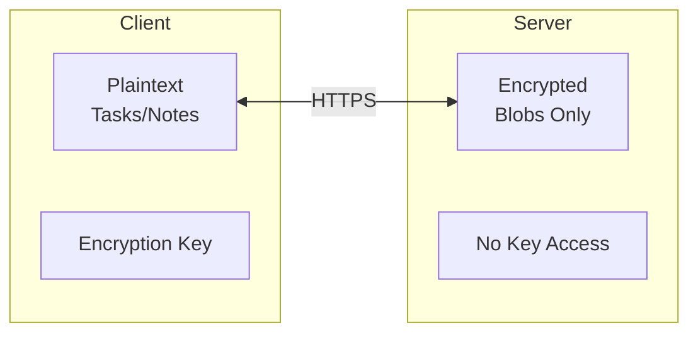

# Sync & Encryption

Taskbook supports syncing your tasks across multiple devices using an encrypted server sync. All data is encrypted client-side before transmission, ensuring the server cannot read your tasks.

## How It Works

1. **Registration**: When you register, a 256-bit encryption key is generated locally
2. **Encryption**: All task data is encrypted with AES-256-GCM before leaving your device
3. **Storage**: The server stores only encrypted blobs - it cannot read your data
4. **Sync**: Each client decrypts data locally using your encryption key



## Setup

### 1. Register an Account

```bash
tb --register
```

You'll be prompted for:

- **Server URL**: The URL of your taskbook server
- **Username**: Your chosen username
- **Email**: Your email address
- **Password**: Your password (entered securely, not shown)

After registration, you'll see your encryption key:

```
Registration successful!
Sync is now enabled.

Your encryption key (save this — it cannot be recovered):

  dGhpcyBpcyBhIGJhc2U2NCBlbmNvZGVkIGtleQ==
```

**IMPORTANT**: Save this encryption key securely. It cannot be recovered if lost. Without it, you cannot access your data on other devices.

### 2. Start Using Taskbook

After registration, sync is automatically enabled. Use taskbook normally:

```bash
tb --task "My synced task"
tb
```

All operations are now synced to the server.

## Login on Another Device

To access your tasks on another device:

```bash
tb --login
```

You'll be prompted for:

- **Server URL**: Same server you registered with
- **Username**: Your username
- **Password**: Your password
- **Encryption key**: The key shown during registration

After login, all your tasks will be available on the new device.

## Migrating Existing Local Data

If you have existing local tasks and want to sync them to the server:

```bash
# First, register or login
tb --register
# or
tb --login

# Then migrate your local data
tb --migrate
```

The migrate command:

1. Reads all items from local storage
2. Reads all items from local archive
3. Encrypts and uploads everything to the server

## Check Sync Status

```bash
tb --status
```

Output shows:

```
Mode:   remote
Server: https://taskbook.example.com
Credentials: saved
Server URL:  https://taskbook.example.com
```

## Logout

To disable sync and remove credentials:

```bash
tb --logout
```

This:

- Invalidates your session on the server
- Deletes local credentials
- Disables sync (returns to local-only mode)

Your data remains on the server and can be accessed by logging in again.

## Encryption Details

### Algorithm

- **Cipher**: AES-256-GCM (Galois/Counter Mode)
- **Key Size**: 256 bits (32 bytes)
- **Nonce**: 96 bits (12 bytes), randomly generated per item
- **Authentication**: Built into GCM mode

### What's Encrypted

The entire `StorageItem` JSON is encrypted, including:

- Description
- Board names
- Dates and timestamps
- Priority
- Completion status
- All other fields

### What the Server Sees

The server can only see:

- Item ID (string key like "1", "2")
- Whether the item is archived
- Creation and update timestamps
- Encrypted blob (unreadable without key)

### Key Storage

The encryption key is stored locally at `~/.taskbook/credentials.json`:

```json
{
  "server_url": "https://taskbook.example.com",
  "token": "session-token-here",
  "encryption_key": "base64-encoded-32-bytes"
}
```

This file should be protected with appropriate file permissions (created with mode 0600).

## Security Best Practices

### Protect Your Encryption Key

- Store it in a password manager
- Keep a backup in a secure location
- Never share it or commit it to version control

### Use HTTPS

Always use HTTPS for the server URL in production:

```
https://taskbook.example.com  ✓
http://taskbook.example.com   ✗ (only for local testing)
```

### Password Security

- Use a strong, unique password
- The server stores passwords hashed with Argon2id

### Device Security

- The encryption key is stored locally
- Protect your devices with screen locks and disk encryption

## Offline Usage

When sync is enabled but the server is unreachable:

- Read operations use cached local data
- Write operations will fail with a connection error

For reliable offline support, consider keeping sync disabled when traveling and syncing when you have connectivity.

## Troubleshooting

### "Connection refused"

The server is not running or not reachable:

```bash
# Check if server is running
curl http://localhost:8080/api/v1/health
```

### "Authentication required" or "Invalid credentials"

Your session may have expired:

```bash
# Login again
tb --login
```

### "Decryption failed"

Wrong encryption key. Make sure you're using the key from registration:

```bash
# Check your saved key
cat ~/.taskbook/credentials.json
```

### Lost Encryption Key

If you've lost your encryption key, your data cannot be recovered. You'll need to:

1. Create a new account with `tb --register`
2. Start fresh with new tasks

This is by design - the server cannot decrypt your data without your key.

## Disabling Sync Temporarily

To work locally without syncing, edit `~/.taskbook.json`:

```json
{
  "sync": {
    "enabled": false,
    "serverUrl": "https://taskbook.example.com"
  }
}
```

Your credentials are preserved for when you re-enable sync.
