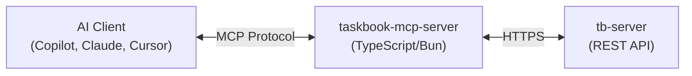

# MCP Server

The **taskbook-mcp-server** is a TypeScript/Bun package that exposes Taskbook task management to MCP-compatible AI tools such as GitHub Copilot, Claude Desktop, Cursor, and others.

It connects to a Taskbook sync server and provides tools and resources for creating, managing, and querying tasks and notes through natural language.

## Documentation

For full setup instructions, available tools, resources, and AI client configuration, see the package README:

👉 [packages/taskbook-mcp-server/README.md](../../packages/taskbook-mcp-server/README.md)

## Architecture

