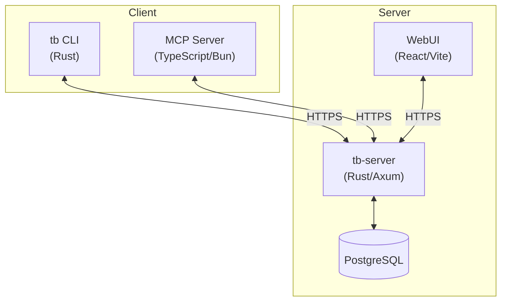

# Taskbook Documentation

Tasks, boards & notes for the command-line habitat.

Taskbook is a CLI application for managing tasks and notes organized into boards. It supports local storage, encrypted server sync, a web UI, and AI tool integration via MCP.

## Architecture

## Documentation

### Getting Started

| Document                                                | Description                                |
| ------------------------------------------------------- | ------------------------------------------ |
| [Installation](01-getting-started/01-installation.md)   | Pre-built binaries, Nix, Cargo, Docker     |
| [Quick Start](01-getting-started/02-quick-start.md)     | Get up and running in minutes              |
| [Configuration](01-getting-started/03-configuration.md) | Themes, display settings, data directories |

### Usage

| Document                                      | Description                               |
| --------------------------------------------- | ----------------------------------------- |
| [CLI Reference](02-usage/01-cli-reference.md) | Complete command reference for `tb`       |
| [Sync & Encryption](02-usage/02-sync.md)      | End-to-end encrypted sync between devices |

### Server & Deployment

| Document                                       | Description                                     |
| ---------------------------------------------- | ----------------------------------------------- |
| [Server Setup](03-server/01-server-setup.md)   | Running `tb-server` with Docker or bare metal   |
| [Kubernetes](03-server/02-kubernetes.md)       | K8s manifests, Helm, scaling, and security      |
| [Observability](03-server/03-observability.md) | Prometheus metrics, Grafana dashboards, logging |

### Integrations

| Document                                   | Description                                    |
| ------------------------------------------ | ---------------------------------------------- |
| [MCP Server](04-mcp-server/01-overview.md) | AI tool integration via Model Context Protocol |

## Quick Links

- **Install**: [Download binaries](https://github.com/tobiashochguertel/taskbook/releases) · [Build from source](01-getting-started/01-installation.md#build-from-source)
- **Use**: [All CLI commands](02-usage/01-cli-reference.md) · [Set up sync](02-usage/02-sync.md)
- **Deploy**: [Docker Compose](03-server/01-server-setup.md#quick-start-with-docker-compose) · [Kubernetes](03-server/02-kubernetes.md)
- **Monitor**: [Prometheus metrics](03-server/03-observability.md) · [Grafana dashboard](03-server/03-observability.md#grafana-dashboard)
- **Integrate**: [MCP server for AI tools](04-mcp-server/01-overview.md)

## Data Compatibility

This implementation uses the same data format as the original [Node.js taskbook](https://github.com/klaussinani/taskbook), allowing seamless migration from the original version.
