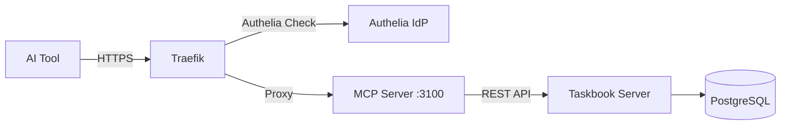

# DevOps HTTP Setup — Taskbook MCP Server

## HTTP Transport

The MCP server supports HTTP transport for multi-client server deployments.

```bash
taskbook-mcp --transport=http --port=3100 --host=0.0.0.0
```

### Endpoints

| Endpoint  | Method   | Description                                     |
| --------- | -------- | ----------------------------------------------- |
| `/mcp`    | `POST`   | MCP JSON-RPC requests (initialize + tool calls) |
| `/mcp`    | `GET`    | Server-to-client streaming (notifications)      |
| `/mcp`    | `DELETE` | Close a session                                 |
| `/health` | `GET`    | Health check — returns `{ "status": "ok" }`     |

### Bearer Token Authentication

```bash
TB_MCP_TRANSPORT=http TB_MCP_ACCESS_TOKEN=my-secret-token taskbook-mcp
```

Clients must send `Authorization: Bearer my-secret-token` on every request.

## Docker

```bash
docker run -p 3100:3100 \
  -e TB_MCP_TRANSPORT=http \
  -e TB_SERVER_URL=https://your-taskbook-server.example.com \
  -e TB_TOKEN=your-token \
  -e TB_ENCRYPTION_KEY=your-key \
  ghcr.io/tobiashochguertel/taskbook-mcp-server:latest
```

## Docker Compose

```bash
# Start with MCP server profile
docker compose --profile mcp up -d
```

The compose service connects to the Taskbook server internally.

## Reverse Proxy (Traefik + Authelia)

Example Traefik labels for the MCP server container:

```yaml
labels:
  - "traefik.enable=true"
  - "traefik.http.routers.taskbook-mcp.rule=Host(`mcp-taskbook.example.com`)"
  - "traefik.http.routers.taskbook-mcp.entrypoints=websecure"
  - "traefik.http.routers.taskbook-mcp.tls.certresolver=letsencrypt"
  - "traefik.http.services.taskbook-mcp.loadbalancer.server.port=3100"
  - "traefik.http.routers.taskbook-mcp.middlewares=authelia@file"
```

### Authelia Access Control

Add to your Authelia `configuration.yml`:

```yaml
access_control:
  rules:
    # MCP endpoints — bypass auth (MCP handles its own auth)
    - domain: mcp-taskbook.example.com
      resources:
        - "^/mcp.*$"
        - "^/sse.*$"
        - "^/health$"
      policy: bypass
    # Everything else requires authentication
    - domain: mcp-taskbook.example.com
      policy: one_factor
```

### AI Tool HTTP Configuration

Once deployed behind a reverse proxy, configure AI tools to use HTTP transport:

```json
{
  "mcpServers": {
    "taskbook": {
      "type": "http",
      "url": "https://mcp-taskbook.example.com/mcp"
    }
  }
}
```

## Architecture


