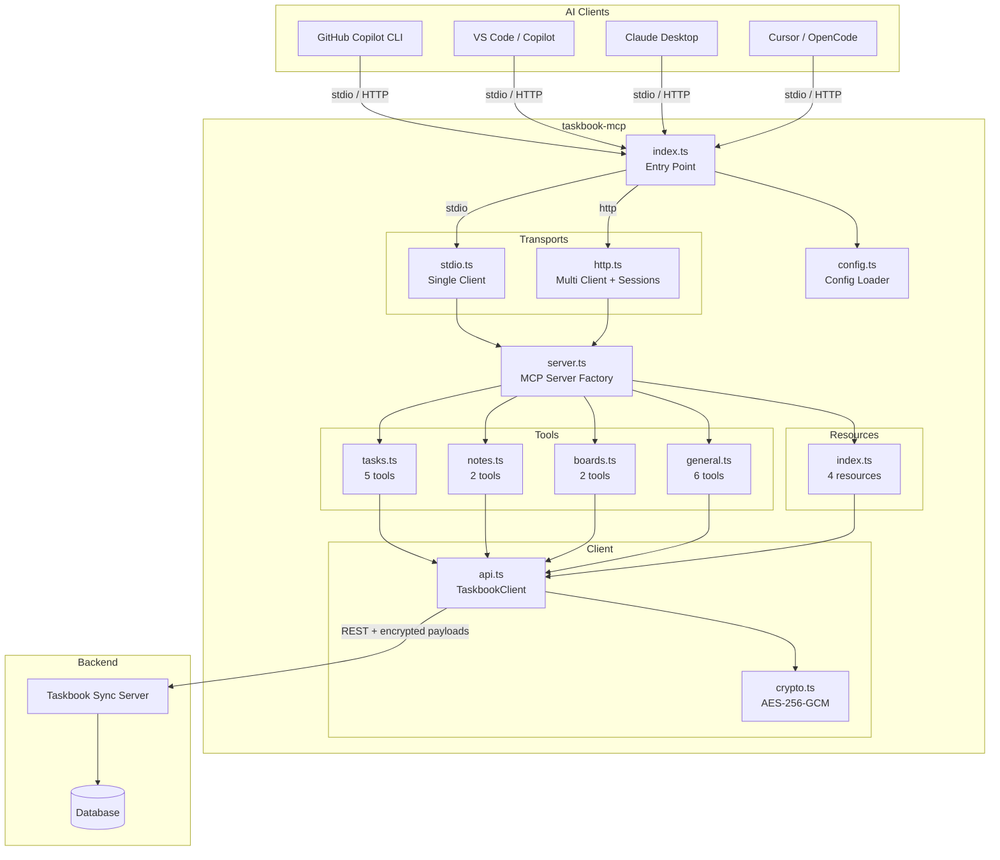

# 🎯 Taskbook MCP Server

> **Model Context Protocol (MCP) server for [Taskbook](https://github.com/hochguertel/taskbook)** — manage tasks, notes, and boards from any MCP-compatible AI tool.

The `taskbook-mcp` server connects LLM clients (GitHub Copilot, Claude Desktop, Cursor, OpenCode, etc.) to a Taskbook sync server, providing 14 tools and 4 resources for full task management through natural language.

---

## 📋 Table of Contents

- [Quick Start](#-quick-start)
- [AI Tool Configuration](#-ai-tool-configuration)
- [Available MCP Tools](#-available-mcp-tools)
- [Available MCP Resources](#-available-mcp-resources)
- [Environment Variables](#-environment-variables)
- [HTTP Transport & DevOps](#-http-transport--devops)
- [Architecture](#-architecture)
- [Development](#-development)

---

## 🚀 Quick Start

### Prerequisites

1. A running **Taskbook sync server** (e.g. `https://taskbook.hochguertel.work`)
2. Authenticated via the `tb` CLI — run `tb --login` to create `~/.taskbook.json`
3. **Bun** runtime (v1.3+) installed

### Install & Run (stdio)

```bash
# Clone and build
cd packages/taskbook-mcp-server
bun install
bun run build

# Run in stdio mode (default) — used by all local AI tools
bun run src/index.ts

# Or build a standalone binary
bun run build:standalone
./dist/taskbook-mcp --help
```

The server reads credentials from `~/.taskbook.json` automatically. No extra configuration needed if you've already logged in with `tb --login`.

---

## 🔧 AI Tool Configuration

All local AI tools use **stdio transport** — the tool spawns `taskbook-mcp` as a child process and communicates over stdin/stdout.

### GitHub Copilot CLI

Add to `~/.copilot/mcp-config.json`:

```json
{
  "mcpServers": {
    "taskbook": {
      "command": "bun",
      "args": ["run", "/path/to/taskbook-mcp-server/src/index.ts"]
    }
  }
}
```

Or with the standalone binary:

```json
{
  "mcpServers": {
    "taskbook": {
      "command": "/path/to/taskbook-mcp"
    }
  }
}
```

### VS Code (GitHub Copilot)

Add to `.vscode/mcp.json` in your workspace or `~/.vscode/mcp.json` globally:

```json
{
  "servers": {
    "taskbook": {
      "command": "bun",
      "args": ["run", "/path/to/taskbook-mcp-server/src/index.ts"],
      "env": {}
    }
  }
}
```

### Claude Desktop

Add to `~/Library/Application Support/Claude/claude_desktop_config.json` (macOS) or `%APPDATA%\Claude\claude_desktop_config.json` (Windows):

```json
{
  "mcpServers": {
    "taskbook": {
      "command": "bun",
      "args": ["run", "/path/to/taskbook-mcp-server/src/index.ts"],
      "env": {}
    }
  }
}
```

### Cursor

Add to `~/.cursor/mcp.json`:

```json
{
  "mcpServers": {
    "taskbook": {
      "command": "bun",
      "args": ["run", "/path/to/taskbook-mcp-server/src/index.ts"]
    }
  }
}
```

### OpenCode

Add to `~/.config/opencode/config.json`:

```json
{
  "mcp": {
    "taskbook": {
      "command": "bun",
      "args": ["run", "/path/to/taskbook-mcp-server/src/index.ts"]
    }
  }
}
```

> 💡 **Tip:** Replace `/path/to/taskbook-mcp-server` with the actual absolute path, or use the standalone binary path after running `bun run build:standalone`.

### Using Environment Variables (all tools)

If you don't have `~/.taskbook.json`, pass credentials via environment variables in any config above:

```json
{
  "env": {
    "TB_SERVER_URL": "https://taskbook.hochguertel.work",
    "TB_TOKEN": "your-session-token",
    "TB_ENCRYPTION_KEY": "your-encryption-key"
  }
}
```

---

## 🛠 Available MCP Tools

| Tool                | Description                                          | Parameters                                    |
| ------------------- | ---------------------------------------------------- | --------------------------------------------- |
| `list_tasks`        | List all tasks, optionally filtered by board         | `board?`                                      |
| `create_task`       | Create a new task on a board                         | `description`, `board?`, `priority?`, `tags?` |
| `complete_task`     | Toggle a task's completion status                    | `task_id`                                     |
| `begin_task`        | Toggle a task's in-progress status                   | `task_id`                                     |
| `set_task_priority` | Set priority level (1=normal, 2=medium, 3=high)      | `task_id`, `priority`                         |
| `list_notes`        | List all notes, optionally filtered by board         | `board?`                                      |
| `create_note`       | Create a new note on a board                         | `description`, `board?`, `body?`, `tags?`     |
| `list_boards`       | List all boards with item counts                     | —                                             |
| `move_item`         | Move a task or note to a different board             | `item_id`, `target_board`                     |
| `search_items`      | Search tasks and notes by description, tag, or board | `query`                                       |
| `edit_item`         | Edit an item's description                           | `item_id`, `description`                      |
| `delete_item`       | Permanently delete a task or note                    | `item_id`                                     |
| `archive_item`      | Move an item to the archive                          | `item_id`                                     |
| `star_item`         | Toggle the star/bookmark on an item                  | `item_id`                                     |
| `get_status`        | Server health, user info, and item statistics        | —                                             |

---

## 📦 Available MCP Resources

| URI                             | Name        | Description                                         |
| ------------------------------- | ----------- | --------------------------------------------------- |
| `taskbook://status`             | `status`    | Server health and authenticated user info (JSON)    |
| `taskbook://boards/{boardName}` | `board`     | Tasks and notes on a specific board (JSON, dynamic) |
| `taskbook://items`              | `all-items` | All tasks and notes across all boards (JSON)        |
| `taskbook://archive`            | `archive`   | All archived tasks and notes (JSON)                 |

The `board` resource is dynamic — it lists available boards and lets clients browse individual board contents.

---

## 📝 Environment Variables

| Variable              | Default                 | Description                                |
| --------------------- | ----------------------- | ------------------------------------------ |
| `TB_MCP_TRANSPORT`    | `stdio`                 | Transport type: `stdio` or `http`          |
| `TB_MCP_PORT`         | `3100`                  | HTTP transport listen port                 |
| `TB_MCP_HOST`         | `127.0.0.1`             | HTTP transport bind address                |
| `TB_MCP_ACCESS_TOKEN` | —                       | Bearer token required for HTTP connections |
| `TB_SERVER_URL`       | from `~/.taskbook.json` | Taskbook sync server URL                   |
| `TB_TOKEN`            | from `~/.taskbook.json` | Taskbook session/auth token                |
| `TB_ENCRYPTION_KEY`   | from `~/.taskbook.json` | AES-256-GCM client-side encryption key     |
| `TB_CONFIG_PATH`      | `~/.taskbook.json`      | Path to taskbook configuration file        |

Environment variables **override** values from `~/.taskbook.json`. If all three `TB_SERVER_URL`, `TB_TOKEN`, and `TB_ENCRYPTION_KEY` are set, the config file is not read at all.

---

## 🌐 HTTP Transport & DevOps

The HTTP transport enables **multi-client** deployments with session management using MCP Streamable HTTP (not SSE — that protocol is deprecated).

### Starting HTTP Mode

```bash
# Via environment variable
TB_MCP_TRANSPORT=http bun run src/index.ts

# Via CLI flag
taskbook-mcp --transport=http --port=3100 --host=0.0.0.0
```

**Endpoints:**

| Endpoint  | Method   | Description                                                 |
| --------- | -------- | ----------------------------------------------------------- |
| `/mcp`    | `POST`   | MCP JSON-RPC requests (initialize + tool calls)             |
| `/mcp`    | `GET`    | Server-to-client streaming (SSE fallback for notifications) |
| `/mcp`    | `DELETE` | Close a session                                             |
| `/health` | `GET`    | Health check — returns `{ "status": "ok" }`                 |

Sessions are tracked via the `mcp-session-id` header. Each session gets its own `TaskbookClient` instance.

### Bearer Token Authentication

Set `TB_MCP_ACCESS_TOKEN` to require a Bearer token on all HTTP requests:

```bash
TB_MCP_TRANSPORT=http TB_MCP_ACCESS_TOKEN=my-secret-token taskbook-mcp
```

Clients must send `Authorization: Bearer my-secret-token` on every request.

### Docker

```bash
# Build the image
docker build -f packages/taskbook-mcp-server/Dockerfile -t taskbook-mcp .

# Run
docker run -p 3100:3100 \
  -e TB_SERVER_URL=https://taskbook.hochguertel.work \
  -e TB_TOKEN=your-token \
  -e TB_ENCRYPTION_KEY=your-key \
  taskbook-mcp
```

The Dockerfile uses a **multi-stage build**: Bun compiles a standalone binary in stage 1, then copies it to a minimal `distroless` runtime image.

### Docker Compose

The MCP server is available as a Docker Compose profile:

```bash
# Start with MCP server
docker compose --profile mcp up -d

# Set credentials via .env or shell
TB_TOKEN=your-token TB_ENCRYPTION_KEY=your-key docker compose --profile mcp up -d
```

The compose service (`mcp-server`) connects to the Taskbook server internally at `http://server:8080`.

### Reverse Proxy (Traefik)

When running behind Traefik or another reverse proxy with Authelia/OIDC:

```yaml
# Example Traefik labels
labels:
  - "traefik.enable=true"
  - "traefik.http.routers.taskbook-mcp.rule=Host(`mcp.example.com`)"
  - "traefik.http.routers.taskbook-mcp.entrypoints=websecure"
  - "traefik.http.routers.taskbook-mcp.tls.certresolver=letsencrypt"
  - "traefik.http.services.taskbook-mcp.loadbalancer.server.port=3100"
  # Authelia middleware for OAuth2/OIDC
  - "traefik.http.routers.taskbook-mcp.middlewares=authelia@docker"
```

For OIDC flows, the client obtains a token from the identity provider and passes it as a Bearer token. Set `TB_MCP_ACCESS_TOKEN` to validate tokens at the MCP layer, or rely on the reverse proxy for authentication.

---

## 🏗 Architecture



### Key Design Decisions

- **Client-side encryption**: All data is encrypted with AES-256-GCM before leaving the MCP server. The Taskbook sync server never sees plaintext.
- **Per-session clients**: HTTP transport creates a separate `TaskbookClient` per session, enabling multi-user deployments.
- **Zod schemas**: All tool parameters are validated with Zod at the MCP protocol level.
- **Bun runtime**: Uses Bun for fast startup, native TypeScript execution, and `bun build --compile` for standalone binaries.

---

## 👩‍💻 Development

### Building from Source

```bash
cd packages/taskbook-mcp-server

# Install dependencies
bun install

# Development mode (watch + auto-reload)
bun run dev

# Type checking
bun run typecheck

# Linting (Biome)
bun run lint

# Build (bundled JS)
bun run build

# Build standalone binary
bun run build:standalone

# Run tests
bun test

# Clean build artifacts
bun run clean
```

### Project Structure

```
src/
├── index.ts              # Entry point, CLI arg parsing
├── server.ts             # MCP server factory, tool/resource registration
├── config.ts             # Config loading (~/.taskbook.json + env vars)
├── client/
│   ├── api.ts            # TaskbookClient — REST API + encryption
│   └── crypto.ts         # AES-256-GCM encrypt/decrypt helpers
├── tools/
│   ├── tasks.ts          # list, create, complete, begin, set_priority
│   ├── notes.ts          # list, create
│   ├── boards.ts         # list, move_item
│   └── general.ts        # search, edit, delete, archive, star, get_status
├── transport/
│   ├── stdio.ts          # Stdio transport (single client)
│   └── http.ts           # HTTP Streamable transport (multi client)
└── resources/
    └── index.ts           # MCP resources (status, boards, items, archive)
```

### Tech Stack

| Component  | Technology                                                                                  |
| ---------- | ------------------------------------------------------------------------------------------- |
| Runtime    | [Bun](https://bun.sh) 1.3+                                                                  |
| MCP SDK    | [@modelcontextprotocol/sdk](https://github.com/modelcontextprotocol/typescript-sdk) ^1.14.0 |
| Validation | [Zod](https://zod.dev) ^3.25                                                                |
| Language   | TypeScript (ESNext, strict mode)                                                            |
| Linter     | [Biome](https://biomejs.dev)                                                                |
| Build      | `bun build` (bundled) / `bun build --compile` (standalone)                                  |

### Contributing

1. Fork the repository
2. Create a feature branch: `git checkout -b feat/my-feature`
3. Make changes and ensure `bun run typecheck && bun run lint && bun test` pass
4. Submit a pull request
